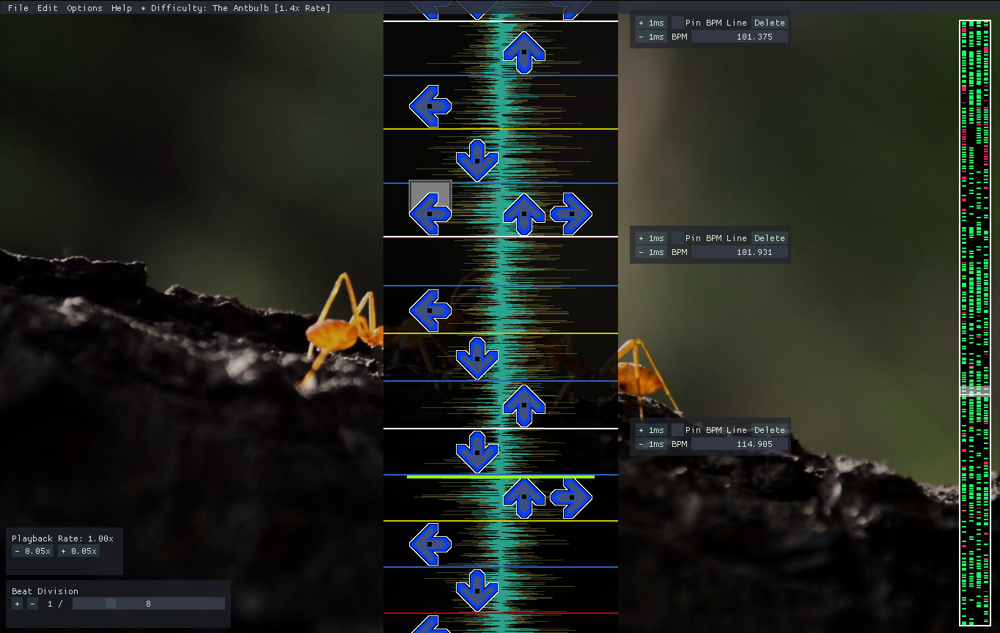

# An editor for osu!mania

## Screenshot


## Details:
- 5 Weeks Half-Time
- Written in C++ within openframeworks, with the ImGui and BASS library
- Had prepared a small engine for parsing beatmaps and rendering them before the start of the specialization course

## Goal and Purpose
The goal of my specialization course at The Game Assembly write an editor to a game called [osu!](https://osu.ppy.sh/), and for a specific gamemode within that game called [osu!mania](https://osu.ppy.sh/help/wiki/Game_Modes/osu!mania). The purpose of this project was to get more experience writing a tool for a specific game, while encountering new and unique problems along the way. 

## What is osu!mania?
osu!mania is a so called "Vertically Scrolling Rhythm Game" (VSRG), which is loosely based on games such as Dance Dance Revolution, IIDX and Guitar Hero. The point of the game, is to press buttons to their respective columns, where notes fly downwards (or upwards depending on the game) to the rhythm of the song. Score is given based on how well you time your button presses with the notes positioning in relation to the "hit receptor", more info [here](https://osu.ppy.sh/help/wiki/Game_Modes/osu!mania). Those files that describes the levels layout to the song are called "beatmaps".

Right away, there are a few interesting problems to solve;

## Rendering notes that are on screen from a big data set
As the title suggests, the problem here is rendering notes that are on screen from a big dataset, while still maintaining the ability to scroll through the entire beatmap dynamically. First, we need to declare how a "note" is defined. A note is defined by a timepoint which represents where the note is in the song in milliseconds (the format that osu! is using), and a column, which describes which column the note's in. 

```cpp
struct TimeFieldObject
{
	int timePoint = 0;
	float visibleTimePoint = -1.f;
};

struct NoteData : public TimeFieldObject
{
	int column = 0;	
  
	bool selected = false;
	bool hasMoved = false;
};
```

In code, a note is purely data and thus is declared as a struct with public members. I've also made bass struct called `TimeFieldObject` which is used as a base for all types that's represented on the timefield, such as beatlines for instance. Keep in mind that I've removed some variables for the sake of keeping it simple and focused. 

The naive way of doing this would be to iterate over every note in the beatmap, and check which ones are on screen and then render them. The issue with this approach is that the performance is bound to the size of the beatmap in question, which could be described as a O(n) complexity. In this case, we wan't something close to a O(1) complexity, since you should be able to create beatmaps based on all types of songs, which includes longer ones. 


## Rendering the waveform efficiently 
## The Editing and placement of "BPM Points"
## About note placement

## Resources
